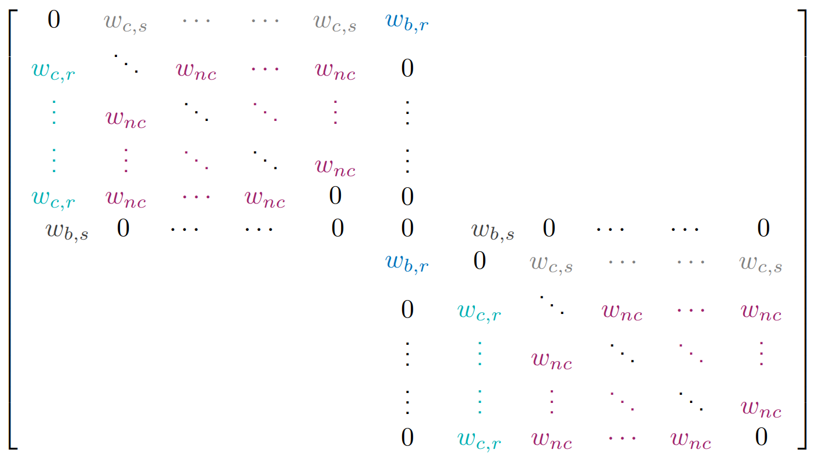

# README 

This code implements a population-scale signaling game. 

Deep neural agents in a population interact by pairs, according to weights defining an interaction graph. 

Each pair of agents plays the signaling game described in [1]. The game proceeds as follows:

 * Sender is shown a target image alongside with one or many distractor images,
 * Sender sends a one-symbol message to Receiver,
 * Receiver obtains Sender's message and all images in random order,
 * Receiver predicts which of the received images is the target one and agents are rewarded if the prediction is correct.

In this version, agents are entities that have both a Sender and a Receiver module. Those two modules share their embedding layer.

Four different setups are implemented (see below for more detailed information):
- Training
- First experiment: combining agents from different communities + central agent 
- Second experiment: two communities with central agents interacting 
- Third experiment: two communities with central agents interacting + bridge agent from another community

Here's a table summarizing the different setups. In the adjacency matrices, the value on line *i* and column *j* represents the weight of the interaction where agent *i* has the role of the speaker and agent $j$ has the role of the listener.

- $w_{c,s}$ stands for the weight of the central agent's interactions as a **sender** 
- $w_{c,r}$ stands for the weight of the central agent's interactions as a **receiver**
- $w_{nc}$ stands for the weight of the noncentral agents' interactions with other noncentral agents (same weight for sender and receiver roles)
- $b_w$ stands for the bridge weight between the 2 nodes of different communities
- $w_{b,s}$ stands for the weight of the bridge agent's interactions as a **sender** 
- $w_{b,r}$ stands for the weight of the bridge agent's interactions as a **receiver**

| `type_exp`   | `subtype_exp`       | Corresponding setup                                                 | Corresponding adjacency matrix                             | Comments |
|:------------:|:-------------------:|:-------------------------------------------------------------------:|:----------------------------------------------------------:|:-----:|
| training     |                     ||| |
| exp_1        |                     |   |                                                            |  |
| exp_1        |neighbors            | | | Non-central agents only interact with their two closest neighbors + the central agent|
| exp_1        |fully_connected      | | | Non-central agents interact with everyone|
| exp_2        |central-central      | | | The bridge interaction is between the two central nodes|
| exp_2        |central-noncentral   | | | The bridge interaction is between one central node and one non-central node |
| exp_2        |noncentral-noncentral| | | The bridge interaction is between two non-central nodes |
| exp_3        |central-central      | | | The bridge agent interacts with the two central nodes |
| exp_3        |central-noncentral   | | | The bridge agent interacts with one central node and one non-central node|
| exp_3        |noncentral-noncentral| | | The bridge agent interacts with two non-central nodes |

A list of command line parameters is available [at the end of this document](#command-line-parameter)

## Training initial communities

To train the initial communities, use the following command (with appropriate arguments):
    
    python train.py --root=root --nb_agents=nb_agents --save_data=True --path_save_exp_data=path

This will create and train `nb_agents` communities of `nb_agents` each and save, for each community, several documents in the 'path' folder:
- Architecture and weights of all agents (e.g. `agent_3.pt`)
- A list of used hyperparameters (args.txt)
- For each epoch, a `json` file containing information about the interactions between agents (e.g. `epoch=7.json`)
  
## First experiment

Once agents are trained in initial communities, the first experiment consists in creating new communities, containing each exactly one agent of each initial community. 

One agent is then assigned the role of _central agent_.

This experiment can be run with the following command:

    python exp1.py --root=root --nb_agents=nb_agents --subtype_exp=fully_connected --save_data=True --path_save_exp_data=path --w_central_sender=2 --w_central_receiver=2 --w_noncentral=1 --path_agents_data=path_trained_agents_data

Out of `nb_agents` communities of `nb_agents` each, this will create and train `nb_agents` new communities of `nb_agents` each. 

[ADD SKETCH]

## Second experiment

UNDER CONSTRUCTION

## Third experiment

UNDER CONSTRUCTION

## Command line parameters
Here is a table summarizing other command line parameters:

| Command line parameter |                              Description                             | Type |     Default     |
|:----------------------:|:--------------------------------------------------------------------:|------|:---------------:|
|        `--root`        |                           data root folder                           | str  |        ''       |
|      `--nb_agents`     |                        total number of agents                        | int  |        1        |
|       `--type_exp`     |                          type of experiment                          | str  |    'training'   |
|     `--subtype_exp`    |                         subtype of experiment                        | str  |        ''       |
|  `--w_central_sender`  |                  sender weight of the central agent                  | int  |        0        |
| `--w_central_receiver` |                 receiver weight of the central agent                 | int  |        0        |
|    `--w_noncentral`    |          weight of interaction between two noncentral nodes          | int  |        0        |
|      `--bridge_w`      |               weight of the bridge interaction (exp_2)               | int  |        0        |
|   `--w_bridge_sender`  |               sender weight of the bridge agent (exp_3)              | int  |        0        |
|  `--w_bridge_receiver` |              receiver weight of the bridge agent (exp_3)             | int  |        0        |
| `--path_save_agents`   | path to the directory where agents' networks will be saved           | str  | '/saved_agents' |
| `--path_agents_data`   | path to the directory where agents' networks from training are saved | str  | ''              |

[1] *"Multi-agent cooperation and the emergence of (natural) language*, A. Lazaridou, A. Peysakhovich, M. Baroni 
[[arxiv]](https://arxiv.org/abs/1612.07182)

