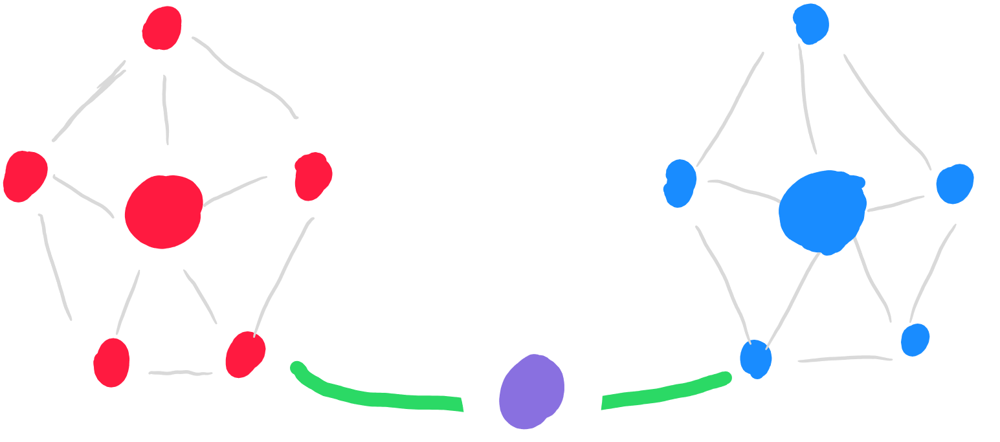

# Population-scale signalling game 

This code implements a population-scale signalling game, as well as three different experiments to analyze the influence of centrality on communication protocols in populations of deep neural agents.

## General framework
### Architecture of the agents

Each agent has two 'modules': Sender and Receiver. Each module is a neural network, as described in this table:

|                                               Sender                                              |                                      Receiver                                     |
|:-------------------------------------------------------------------------------------------------:|:---------------------------------------------------------------------------------:|
|                  **Linear (in_features=feat_size, out_features=embedding_size)**                  |          **Linear (in_features=feat_size, out_features=embedding_size)**          |
| Conv2D (in_channels=1, out_channels=hidden_size, kernel_size=(game_size,1), stride=(game_size,1)) | Embedding (num_embeddings=vocab_size, embedding_dim=embedding_size) if Reinforce  |
|    Conv2D (in_channels=1, out_channels=1, kernel_size=(hidden_size,1), stride=(hidden_size,1))    |   Linear (in_features=vocab_size, out_features=embedding_size) if Gumbel Softmax  |
|                    Linear (in_features=embedding_size, out_features=vocab_size)                   |                                                                                   |

Sender and Receiver share their first linear layer (in bold), used to embed the images.

### Signalling game

Agents in a population interact by pairs, according to weights defining an interaction graph. 

Each pair of agents plays the signalling game described in [[1]](#references). The game proceeds as follows (image from [[2]](#references)):

 * Sender is shown a target image alongside with one or many distractor images,
 * Sender sends a one-symbol message to Receiver,
 * Receiver obtains Sender's message and all images in random order,
 * Receiver predicts which of the received images is the target one and agents are rewarded if the prediction is correct.

The data used in the paper can be downloaded from [this link](https://dl.fbaipublicfiles.com/signaling_game_data).

## Implemented setups

Four different setups are implemented (see below for more detailed information):
- Training
- First experiment: combining agents from different communities + central agent 
- Second experiment: two communities with central agents interacting 
- Third experiment: two communities with central agents interacting + bridge agent from another community

Here's a table summarizing the different setups. In the adjacency matrices, the value on line *i* and column *j* represents the weight of the interaction where agent *i* has the role of the sender and agent $j$ has the role of the receiver.

| `type_exp`   | `subtype_exp`       | Corresponding setup                                                          | Corresponding adjacency matrix                             | Comments                             |
|:------------:|:-------------------:|:----------------------------------------------------------------------------:|:----------------------------------------------------------:|:-------------------------------------------------------------------------------------------------:|
| training     |                     |         ||                                      |
| exp_1        |                     ||                                                            |                                      |
| exp_1        |neighbors            |          | | Non-central agents only interact with their two closest neighbors + the central agent|
| exp_1        |fully_connected      |          | | Non-central agents interact with everyone                                       |
| exp_2        |central-central      |          | | The bridge interaction is between the two central nodes                                |
| exp_2        |central-noncentral   |          | | The bridge interaction is between one central node and one non-central node            |
| exp_2        |noncentral-noncentral|          | | The bridge interaction is between two non-central nodes                                |
| exp_3        |central-central      |          | | The bridge agent interacts with the two central nodes                         |
| exp_3        |central-noncentral   |          | | The bridge agent interacts with one central node and one non-central node     |
| exp_3        |noncentral-noncentral|          | | The bridge agent interacts with two non-central nodes                         |

- $w_{c,s}$ stands for the weight of the central agent's interactions as a **sender** 
- $w_{c,r}$ stands for the weight of the central agent's interactions as a **receiver**
- $w_{nc}$ stands for the weight of the noncentral agents' interactions with other noncentral agents (same weight for sender and receiver roles)
- $b_w$ stands for the bridge weight between the 2 nodes of different communities
- $w_{b,s}$ stands for the weight of the bridge agent's interactions as a **sender** 
- $w_{b,r}$ stands for the weight of the bridge agent's interactions as a **receiver**

### Training initial communities

To train the initial communities, use the following command (with appropriate arguments):
    
    python train.py --root=root --nb_agents=nb_agents --save_data=True --path_save_exp_data=path

This will create and train `nb_agents` communities of `nb_agents` each and save, for each community, several documents in the 'path' folder:
- Architecture and weights of all agents
- A list of used hyperparameters 
- For each epoch, a `json` file containing information about the interactions between agents

| Command line parameter |                              Description                             | Type |     Default     |
|:----------------------:|:--------------------------------------------------------------------:|------|:---------------:|
|        `--root`        |                           data root folder                           | str  |        ''       |
|      `--nb_agents`     |                   number of agents in each community                 | int  |        1        |
|      `--save_data`     |                  whether to save training data or not                | bool |      False      |
| `--path_save_exp_data` |      path to the directory where agents' networks will be saved      | str  |    '/results'   |

A list of other command line parameters is available [at the end of this document](#other-command-line-parameters)
  
### First experiment

Once agents are trained in initial communities, the first experiment consists in creating new communities, containing each exactly one agent of each initial community. 

One agent is then assigned the role of _central agent_.

This experiment can be run with the following command:

    python exp1.py --root=root --nb_agents=nb_agents --subtype_exp=fully_connected --save_data=True --path_save_exp_data=path --w_central_sender=2 --w_central_receiver=2 --w_noncentral=1 --path_agents_data=path_trained_agents_data

| Command line parameter |                              Description                             | Type |     Default     |        Possible values         |
|:----------------------:|:--------------------------------------------------------------------:|:----:|:---------------:|:------------------------------:|
|        `--root`        |                           data root folder                           | str  |       ''        |              Any               |
|      `--nb_agents`     |              number of agents in each training community             | int  |        1        |              Any               |
|     `--subtype_exp`    |                         subtype of experiment                        | str  |'fully_connected'| 'fully_connected', 'neighbors' |
|  `--w_central_sender`  |                  sender weight of the central agent                  | int  |        0        |              Any               |
| `--w_central_receiver` |                 receiver weight of the central agent                 | int  |        0        |              Any               |
|    `--w_noncentral`    |          weight of interaction between two noncentral nodes          | int  |        0        |              Any               |
|      `--save_data`     |                  whether to save training data or not                | bool |      False      |          True, False           |
| `--path_save_exp_data` |      path to the directory where agents' networks will be saved      | str  |   '/results'    |              Any               |
| `--path_agents_data`   | path to the directory where agents' networks from training are saved | str  |       ''        |              Any               |

See [this section](#implemented-setups) for more information about the different weights that can be configured, and [here](#other-command-line-parameters) about other command line parameters.

Out of `nb_agents` communities of `nb_agents` each, this will create and train `nb_agents` new communities of `nb_agents` each. 

Training communities on the left, mixed communities used in the experiment on the right

Inside each new community, agents play the game in the same way as in the training. For each community, several documents will be saved in the 'path' folder:
- Architecture and weights of all agents before and after the experiment
- A list of used hyperparameters and origin of the agents in the new community
- For each epoch, a `json` file containing information about the interactions between agents

### Second experiment

The second experiment consists in making two different trained communities interact via 2 inner agents.

This experiment can be run with the following command:

    python exp2.py --nb_agents=nb_agents --subtype_exp=subtype_exp --save_data=True --path_save_exp_data=path --w_central_sender=2 --w_central_receiver=2 --w_noncentral=1 --bridge_w=2 --path_agents_data=path_trained_agents_data

| Command line parameter |                              Description                             | Type |     Default     |                         Possible values                          |
|:----------------------:|:--------------------------------------------------------------------:|:----:|:---------------:|:----------------------------------------------------------------:|
|        `--root`        |                           data root folder                           | str  |       ''        |                               Any                                |
|      `--nb_agents`     |              number of agents in each training community             | int  |        1        |                               Any                                |
|     `--subtype_exp`    |                         subtype of experiment                        | str  |       ''        | 'central-central', 'central-noncentral', 'noncentral-noncentral' |
|  `--w_central_sender`  |                  sender weight of the central agent                  | int  |        0        |                               Any                                |
| `--w_central_receiver` |                 receiver weight of the central agent                 | int  |        0        |                               Any                                |
|    `--w_noncentral`    |          weight of interaction between two noncentral nodes          | int  |        0        |                               Any                                |
|      `--bridge_w`      |                    weight of the bridge interaction                  | int  |        0        |                               Any                                |
|      `--save_data`     |                  whether to save training data or not                | bool |      False      |                           True, False                            |
| `--path_save_exp_data` |      path to the directory where agents' networks will be saved      | str  |   '/results'    |                               Any                                |
| `--path_agents_data`   | path to the directory where agents' networks from training are saved | str  |       ''        |                               Any                                |

See [this section](#implemented-setups) for more information about the different weights that can be configured, and [here](#other-command-line-parameters) about other command line parameters. 

In every new setup, agents play the game in the same way as in the training. For setup, several documents will be saved in the 'path' folder:
- Architecture and weights of all agents before and after the experiment
- A list of used hyperparameters and origin of the agents in the setup
- For each epoch, a `json` file containing information about the interactions between agents

### Third experiment

The second experiment consists in making two different trained communities interact via a bridge agent coming from another community.

This experiment can be run with the following command:

    python exp3.py --nb_agents=nb_agents --subtype_exp=subtype_exp --save_data=True --path_save_exp_data=path --w_central_sender=2 --w_central_receiver=2 --w_noncentral=1 --w_bridge_sender=1 --w_bridge_receiver=1 --path_agents_data=path_trained_agents_data

| Command line parameter |                              Description                             | Type |     Default     |                         Possible values                          |
|:----------------------:|:--------------------------------------------------------------------:|:----:|:---------------:|:----------------------------------------------------------------:|
|        `--root`        |                           data root folder                           | str  |       ''        |                               Any                                |
|      `--nb_agents`     |              number of agents in each training community             | int  |        1        |                               Any                                |
|     `--subtype_exp`    |                         subtype of experiment                        | str  |       ''        | 'central-central', 'central-noncentral', 'noncentral-noncentral' |
|  `--w_central_sender`  |                  sender weight of the central agent                  | int  |        0        |                               Any                                |
| `--w_central_receiver` |                 receiver weight of the central agent                 | int  |        0        |                               Any                                |
|    `--w_noncentral`    |          weight of interaction between two noncentral nodes          | int  |        0        |                               Any                                |
|  `--w_bridge_sender`   |                   sender weight of the bridge agent                  | int  |        0        |                               Any                                |
| `--w_bridge_receiver`  |                  receiver weight of the bridge agent                 | int  |        0        |                               Any                                |
|      `--save_data`     |                  whether to save training data or not                | bool |      False      |                           True, False                            |
| `--path_save_exp_data` |      path to the directory where agents' networks will be saved      | str  |   '/results'    |                               Any                                |
| `--path_agents_data`   | path to the directory where agents' networks from training are saved | str  |       ''        |                               Any                                |

See [this section](#implemented-setups) for more information about the different weights that can be configured, and [here](#other-command-line-parameters) about other command line parameters.

In every new setup, agents play the game in the same way as in the training. For setup, several documents will be saved in the 'path' folder:
- Architecture and weights of all agents before and after the experiment
- A list of used hyperparameters and origin of the agents in the setup
- For each epoch, a `json` file containing information about the interactions between agents

## Other command line parameters
Here is a table summarizing other command line parameters:

| Command line parameter |                                     Description                               | Type |     Default     |              Possible values            |  
|:----------------------:|:-----------------------------------------------------------------------------:|:----:|:---------------:|:---------------------------------------:|
|       `--tau_gs`       |                    softmax temperature for sender                             |float |       10.0      |                   Any                   |
|      `--game_size`     |      number of images used (one is the target, the rest are distractors)      | int  |        2        |                   Any                   |
|        `--same`        |whether distractor images should be sampled from the same concept as the target| int  |        0        |                   0,1                   |
|     `--vocab_size`     |                  number of symbols for communication                          | int  |       100       |                   Any                   |
|     `--batch_size`     |                                batch size                                     | int  |       32        |                   Any                   |
|   `--embedding_size`   |                size of the symbol embeddings used by receiver                 | int  |       50        |                   Any                   |
|     `--hidden_size`    |                              hidden layer size                                | int  |       20        |                   Any                   |
| `--batches_per_epoch`  |                        how many batches per epoch                             | int  |       100       |                   Any                   |
|       `--mode`         |                               training mode                                   | str  |       'rf'      | 'rf' (Reinforce), 'gs' (Gumbel Softmax) |
|      `--gs_tau`        |                      Gumbel Softmax relaxation temperature                    |float |       1.0       |                   Any                   |

## References

[1] *Multi-agent cooperation and the emergence of (natural) language*, A. Lazaridou, A. Peysakhovich, M. Baroni 
[[arxiv]](https://arxiv.org/abs/1612.07182)

[2] *Emergent Multi-Agent Communication in the Deep Learning Era*, A. Lazaridou and M. Baroni
[[arxiv]](https://doi.org/10.48550/arXiv.2006.02419)

